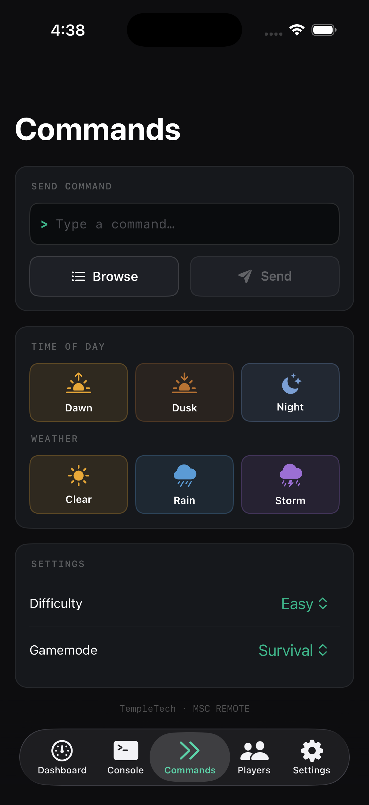
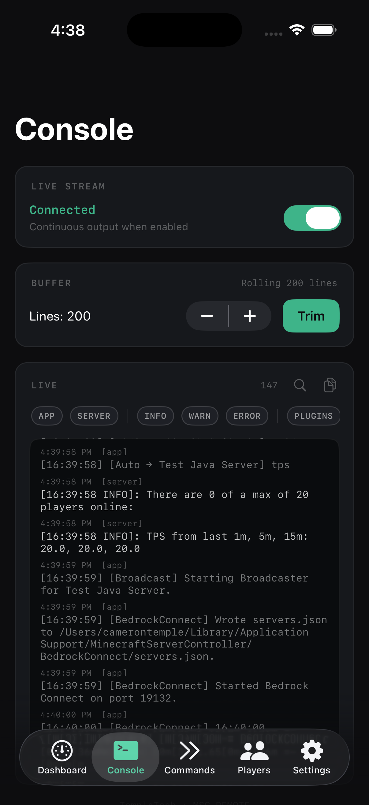
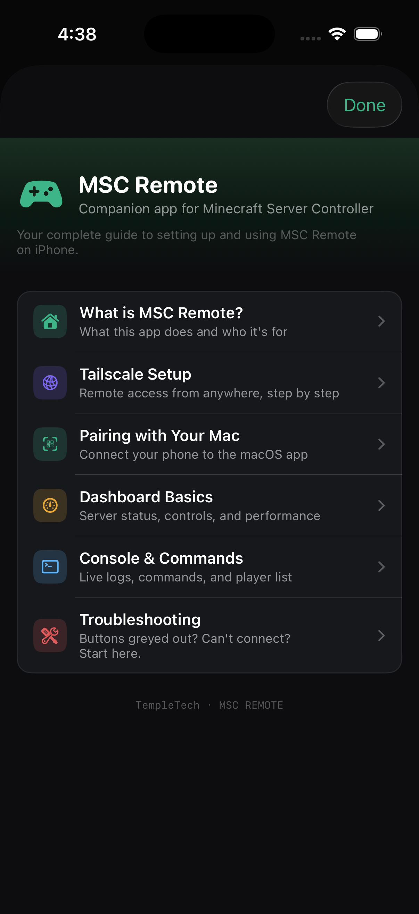

# MSC Remote

**Control your Minecraft server from your iPhone.**

MSC Remote is the iOS companion app for [Minecraft Server Controller](../MSCmacOS) (MSC) — a macOS app for running Minecraft servers. Once paired, MSC Remote lets you monitor server status, read the live console, send commands, and view online players from anywhere on your local network or VPN.

> **Built by ctemple9 / TempleTech**

---

## Screenshots

---

## Features

- **Server Dashboard** — live status, TPS, RAM, CPU, uptime, and one-tap start/stop
- **Live Console** — real-time WebSocket stream with category filtering
- **Send Commands** — quick commands, favorites, and recent history
- **Players Tab** — see who's online, with avatar thumbnails
- **QR Pairing** — scan a QR code from the macOS app to pair instantly
- **Notifications** — get notified when the server comes online, goes offline, or a player joins
- **Join Card** — customizable card with server connection info to share with friends
- **Dark mode only** — because your server room doesn't need ambient lighting

---

## Requirements

- **iOS 16** or later (iPhone or iPad)
- **MSC for macOS** running on your Mac — [get it here](../MSCmacOS)
- Both devices on the **same network** (LAN, Wi-Fi) or connected via **Tailscale VPN**

---

## Setup

1. Install and open MSC on your Mac
2. In MSC, open Preferences → Remote API and confirm the Remote API is enabled
3. Open MSC Remote on your iPhone
4. Tap the QR icon and scan the pairing QR code shown in MSC's Preferences
5. That's it — you're paired

You can also pair manually by entering your Mac's IP address (or Tailscale hostname) and the token shown in MSC Preferences.

---

## Connecting Over the Internet

MSC Remote is designed for **local network and VPN use**. The MSC Remote API uses plain HTTP, which is intentionally blocked for public internet addresses.

To connect from outside your home network, use **[Tailscale](https://tailscale.com)** — a free VPN that connects your devices securely. Once Tailscale is installed on both your Mac and iPhone, you can use your Mac's Tailscale hostname (like `your-mac.tail123.ts.net`) as the base URL in MSC Remote.

---

## Privacy

MSC Remote does not connect to any third-party service. All communication is between your iPhone and your own Mac.

- **No analytics** — nothing is tracked
- **No crash reporting** — no data is sent anywhere
- **Camera** — used only for QR code scanning during pairing; no photos are taken or stored
- **Token** — the pairing token is stored in the iOS Keychain; it is never written to iCloud or UserDefaults

---

## License

MIT — see [LICENSE](../../LICENSE)

---

## Related

- [Minecraft Server Controller (macOS)](../MSCmacOS)
