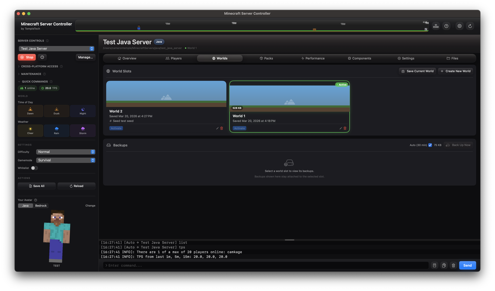
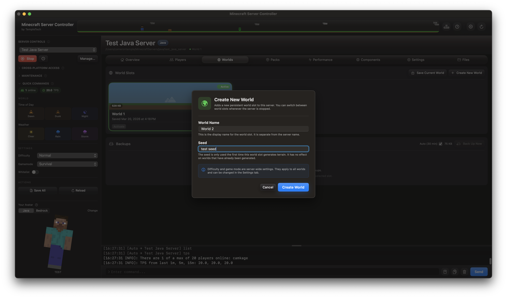
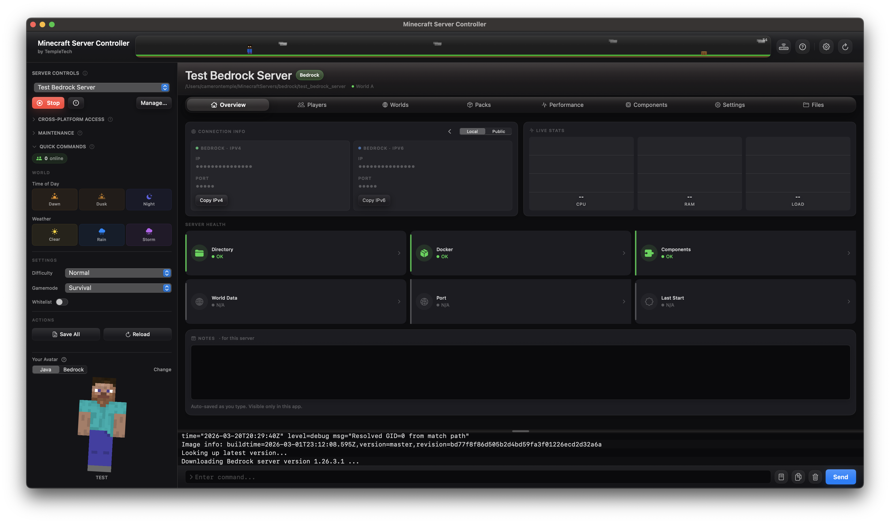
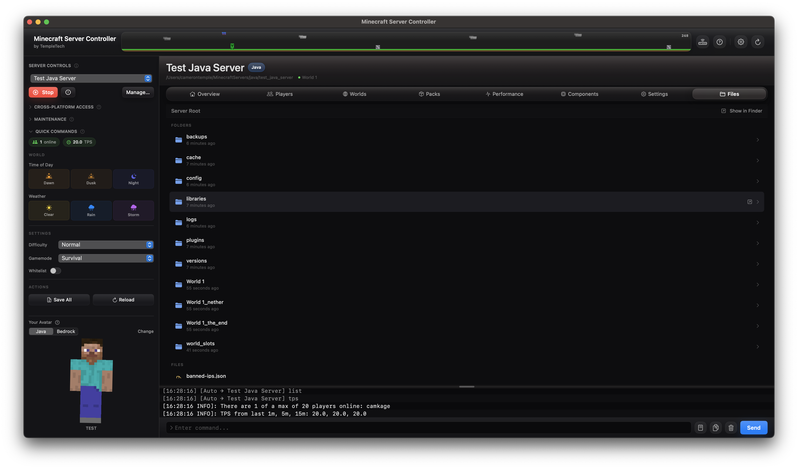

# Minecraft Server Controller (MSC)

**One app. Any Minecraft server.**

Minecraft Server Controller is a macOS utility for running and managing Minecraft servers — both Java (Paper) and Bedrock (via Docker) — from a single, purpose-built interface. No terminal required.

> **Built by CTemple9 / TempleTech**

---

## Screenshots

---

## Features

### Java (Paper) Servers
- Download and manage Paper jar versions
- Start, stop, and monitor server processes
- Live console with filtering, search, and command entry
- Auto and manual world backups with metadata
- World slot management — duplicate, swap, export, and replace worlds
- Plugin template library
- Performance monitoring (TPS, RAM, CPU, uptime)
- Server properties editor

### Bedrock Servers
- Docker-based Bedrock runtime via `itzg/minecraft-bedrock-server`
- BedrockConnect integration for cross-platform LAN play
- Xbox Broadcast support for console/mobile discovery
- Allowlist management
- Bedrock-specific properties editor

### Both Server Types
- Session log and player history
- Resource pack management
- DuckDNS hostname support
- Remote API for the **MSC Remote** iOS companion app
- Onboarding and setup wizard
- Server notes

---

## Requirements

- **macOS** 13 or later
- **Java** (for Java servers) — [Adoptium Temurin](https://adoptium.net) recommended
- **Docker Desktop** (for Bedrock servers) — [docker.com](https://www.docker.com/products/docker-desktop/)

---

## Installation

### Option 1: Download the App
Download the latest release from the [Releases page](../../releases).

### Option 2: Build from Source
1. Clone this repo
2. Open `Minecraft_Server_Controller.xcodeproj` in Xcode 15 or later
3. Select your development team in Signing & Capabilities
4. Build and run (`⌘R`)

---

## Privacy

MSC does not include analytics, telemetry, or crash reporting. Nothing is sent to TempleTech.

The app makes network requests **on your behalf** to:

| Service | Purpose |
|---------|---------|

| `api.ipify.org` | Detect your public IP address for connection info display |
| `portchecker.io` | Check whether your server port is open to the internet |
| `minotar.net`, `mc-heads.net`, `api.mcheads.org` | Fetch player avatar images using Minecraft usernames |
| `api.github.com` | Check for latest versions of Paper, Xbox Broadcast, BedrockConnect jars |
| `papermc.io`, `github.com`, `minecraft.net` | Download server jars and version manifests |

**Credentials:** The Remote API token and Xbox Broadcast account password are stored in the macOS Keychain. Server names, notes, and settings are stored locally in `~/Library/Application Support/MinecraftServerController/server_config_swift.json`.

---

## MSC Remote (iOS Companion App)

MSC includes a built-in Remote API server. The **MSC Remote** iOS app connects to this API to monitor and control your servers from your phone.

---

## Architecture

MSC is a SwiftUI/MVVM macOS app:

- `AppViewModel` — central state, split across `AppViewModel+X.swift` extension files
- `ServerBackend` protocol — `JavaServerBackend` and `BedrockServerBackend` implement server-type-specific logic
- `ConfigManager` — persists settings; secrets go to Keychain, config goes to JSON
- `RemoteAPIServer` — serves the iOS companion app over a local HTTP API
- `MSCStyles.swift` — single source of truth for all design tokens

---

## License MIT — see [LICENSE](LICENSE)

---

## Acknowledgements

- [PaperMC](https://papermc.io) — the Paper Minecraft server
- [GeyserMC/Geyser](https://github.com/GeyserMC/Geyser) — protocol translation layer allowing Bedrock clients to join Java servers
- [GeyserMC/Floodgate](https://github.com/GeyserMC/Floodgate) — hybrid mode plugin for Geyser, allowing Bedrock players without a Java account
- [itzg/minecraft-bedrock-server](https://github.com/itzg/docker-minecraft-bedrock-server) — Bedrock Dedicated Server Docker image
- [BedrockConnect](https://github.com/Pugmatt/BedrockConnect) — cross-platform server browser for Bedrock/console players
- [MCXboxBroadcast](https://github.com/MCXboxBroadcast/Broadcaster) — Xbox/console LAN discovery broadcasting
- [Adoptium Temurin](https://adoptium.net) — recommended Java runtime for Paper servers
- [Docker Desktop](https://www.docker.com/products/docker-desktop/) — container runtime for Bedrock server management
