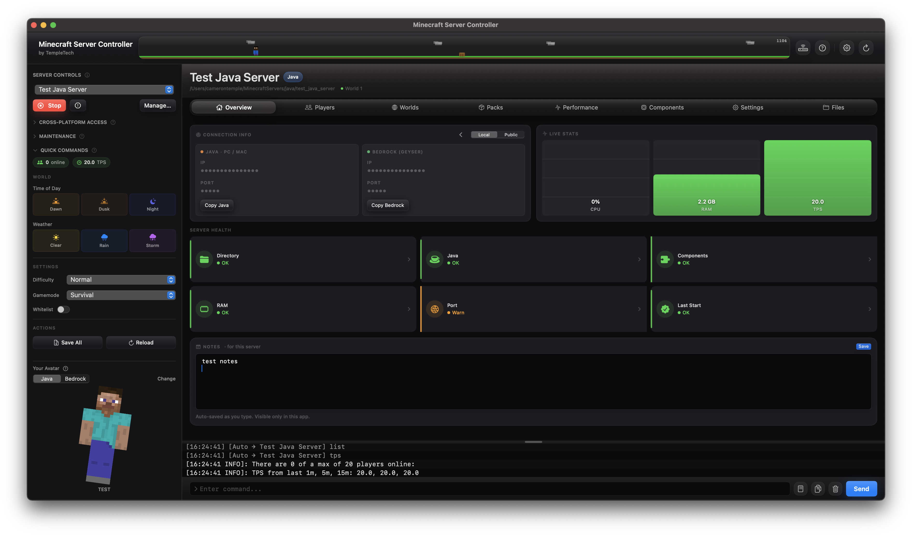
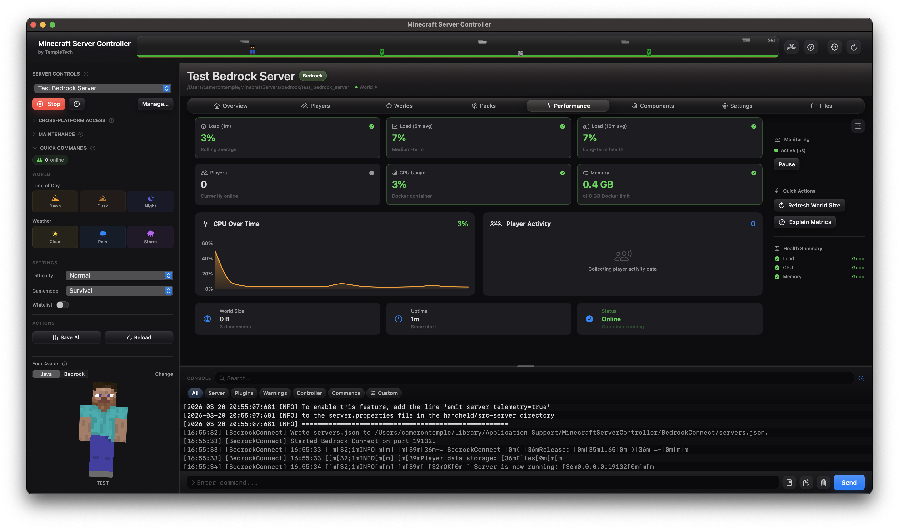
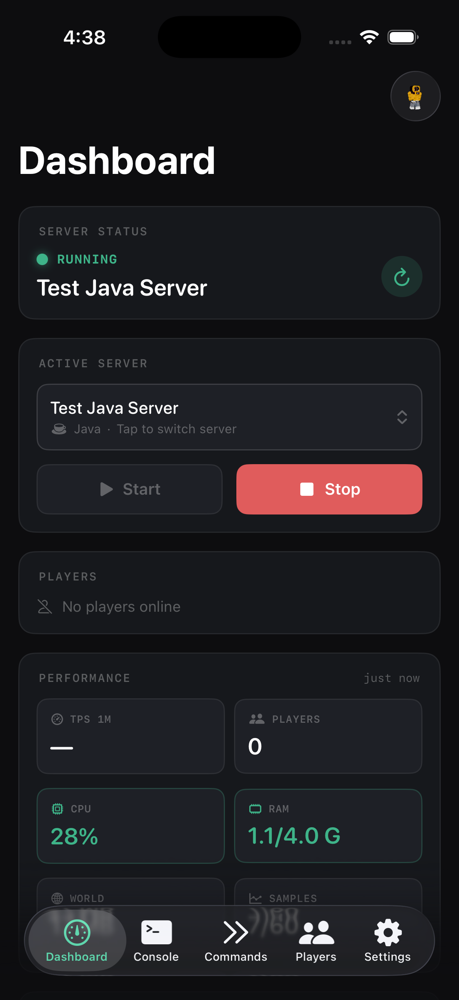

# Minecraft Server Controller

> **Built by ctemple9**

---

I made this app because Realms kept charging me for months I barely played, and self-hosting a server on macOS was more annoying than it needed to be. Terminal works, but parsing through console output gets old, and keeping things updated is a pain when you've never done it before. I also wanted cross-play between Bedrock and Java, which meant setting up Geyser and Floodgate, which meant more things to break.

So I built MSC. It handles both Java and Bedrock servers, walks you through port forwarding, and keeps everything in one place. If you've been putting off hosting your own server because it seemed like too much work, and you're just trying to play with friends or family in different houses, this is for you.

> [!WARNING]
> **Work in progress.** It works, but you will hit bugs. Open an issue if something breaks, it genuinely helps.

---

## Quick Start

### Before you begin
- **macOS 13+**
- **Java** is required for **Paper / Java Edition** servers
- **Docker Desktop** is required for **Bedrock** servers
- **Port forwarding is required** if players outside your home network will join
- You must be able to log into your router and change its port forwarding settings

### Start a server
1. Download and open **Minecraft Server Controller**
2. Create a new server
3. Choose **Paper** or **Bedrock**
4. Complete setup and start the server
5. Open **Port Forwarding Help**
6. Log into your router and forward the server port
7. Share your public IP or DuckDNS hostname with friends

---

### MSC macOS - Overview

### MSC macOS - Performance 

### MSC Remote — iOS Dashboard

---

## Apps

### [MSC — Minecraft Server Controller (macOS)](MSCmacOS/)

Run and manage Java and Bedrock servers from a native macOS app. No terminal required.

- Start, stop, and monitor Java (Paper) and Bedrock servers
- Live console with filtering, search, and command entry
- World slot management, auto backups, performance monitoring
- Remote API for the iOS companion app

→ [View macOS README](MSCmacOS/README.md)

---

### [MSC Remote (iOS)](MSCiOS/)

Control your server from your iPhone over LAN or Tailscale VPN.

- Live server status, TPS, RAM, CPU
- Real-time console stream
- Send commands, view online players
- QR code pairing with the macOS app

→ [View iOS README](MSCiOS/README.md)

---

## Requirements

| App | Requirement |
|-----|-------------|
| MSC (macOS) | macOS 13 or later |
| MSC Remote (iOS) | iOS 16 or later |
| Java servers | [Adoptium Temurin](https://adoptium.net) |
| Bedrock servers | [Docker Desktop](https://www.docker.com/products/docker-desktop/) |

---

## Built on Open Source

MSC would not exist without these projects. Thanks to everyone who built and maintains them:

| Project | Role |
|---------|------|
| [PaperMC](https://papermc.io) | Java server runtime |
| [GeyserMC / Geyser](https://github.com/GeyserMC/Geyser) | Protocol bridge, lets Bedrock clients join Java servers |
| [GeyserMC / Floodgate](https://github.com/GeyserMC/Floodgate) | Allows Bedrock players to join without a Java account |
| [itzg / minecraft-bedrock-server](https://github.com/itzg/docker-minecraft-bedrock-server) | Docker image for Bedrock Dedicated Server |
| [BedrockConnect](https://github.com/Pugmatt/BedrockConnect) | Cross-platform server browser for Bedrock and console players |
| [MCXboxBroadcast](https://github.com/MCXboxBroadcast/Broadcaster) | Xbox and console LAN discovery broadcasting |

---

## License

MIT — see [LICENSE](LICENSE)
